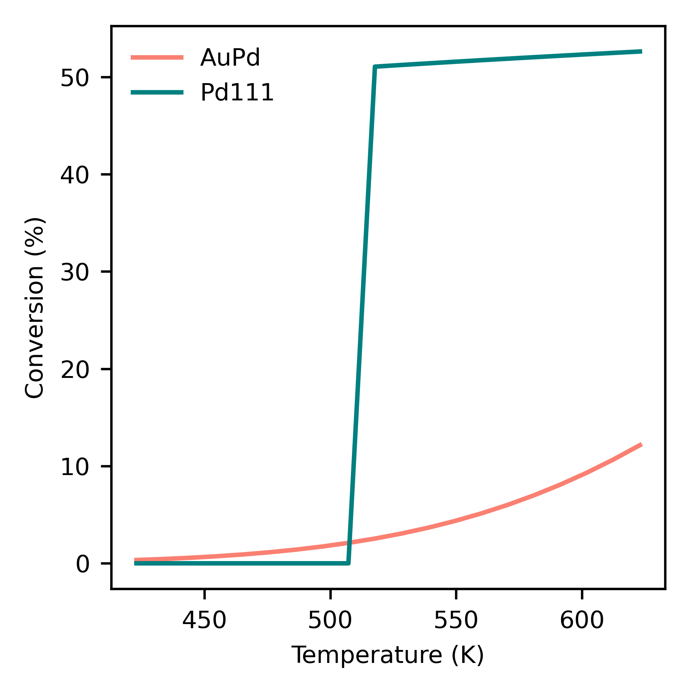

.. _cooxreactor:
.. index:: CO oxidation in a reactor

CO oxidation in a reactor
*************************************

Here, we will consider the CO oxidation reaction on neat Pd and an AuPd alloy, using DFT data from Tiburski *et al.* [1]_ Three elementary steps are considered, accounting for reversible adsorption of CO and dissociative adsorption of oxygen, and irreversible conversion of adsorbed CO and oxygen to carbon dioxide. Where s represents a free catalyst site:

.. math::
   :nowrap:
   
    \begin{align}
        \textsf{CO} + 
        \textsf{s}
        &\leftrightarrow
        \textsf{sCO}
        \\
        {\textsf{O}}_{2} + 
        2\textsf{s}
        &\leftrightarrow
        2\textsf{sO}
        \\
        \textsf{sO} + 
        \textsf{sCO}
        &\rightarrow
        {\textsf{CO}}_{2} + 
        2\textsf{s}
        \textsf{.}
    \end{align}

Creating an input file
-------------------------------------

The previous example described the components required to specify an input file. Here, we will create two input files, one for Pd111 and one for AuPd. In this example, we will use the harmonic approximation (only vibrational free energy contributions) for ``adsorbate`` states, and the ideal gas approximation (vibrational, rotational and translational free energy contributions) for ``gas`` states. We will compute the energy of the ``TS`` state using the scaling relation for CO oxidation given in Falsig *et al.* [2]_ (more on this later). We will read the electronic energies calculated using DFT from OUTCAR files from VASP and the frequencies from *vib.log* files created using ASE and VASP. We will let PyCatKin obtain the necessary information about the gas molecules (mass, inertia and shape) from their respective atoms objects using ASE. In this example, the data is stored in a directory called *data*, with subdirectories for each state. 

With this information, we can specify the states which include the clean surface (*s*), adsorbed CO (*sCO*) and O (*sO*) and gaseous CO, O\ :sub:`2` and CO\ :sub:`2`::

    {
        "states":
        {
            "s":
            {
                "state_type": "surface",
                "path": "data/Pd111"
            },
            "sCO":
            {
                "state_type": "adsorbate",
                "path": "data/CO.Pd111"
            },
            "sO":
            {
                "state_type": "adsorbate",
                "path": "data/O.Pd111"
            },
            "CO":
            {
                "state_type": "gas",
                "sigma": 1,
                "path": "data/CO"
            },
            "O2":
            {
                "state_type": "gas",
                "sigma": 2,
                "path": "data/O2"
            },
            "CO2":
            {
                "state_type": "gas",
                "sigma": 2,
                "path": "data/CO2"
            }
        },...
    }

The above specifies the Pd111 states. The input file for AuPd will be equivalent but with the paths set to "data/AuPd", "data/CO.AuPd" and "data/O.AuPd" for the adsorbates. 

Note that we have not defined a transition state for the reaction. Here, we will introduce a ``ScalingState`` class state using the keyword ``scaling relation states`` and call it *SRTS*. Scaling relation states are defined by providing a dictionary of ``scaling_coeffs``, the gradient and intercept of the scaling relation and a dictionary of ``scaling_reactions``, the reactions that specify the binding energies the scaling relation depends on. Note that the Falsig scaling relation depends on the binding energy of O, but we will define the adsorption reaction for O\ :sub:`2`, which will lead to two bound oxygen atoms; thus, we need to specify a ``multiplicity`` of 0.5::

    {
       "scaling relation states":
        {
            "SRTS":
            {
                "state_type": "TS",
                "scaling_coeffs":
                {
                    "gradient": 0.7,
                    "intercept": 0.02
                },
                "scaling_reactions":
                {
                    "CO":
                    {
                        "reaction": "CO_ads",
                        "multiplicity": 1.0
                    },
                    "O":
                    {
                        "reaction": "O2_ads",
                        "multiplicity": 0.5
                    }
                },
                "dereference": true,
                "use_descriptor_as_reactant": true
            }
        },...
    }

The setting ``dereference=True`` is required in this example because we will need to subtract the absolute energies of the transition state and adsorbates to calculate the reaction barrier. The setting ``use_descriptor_as_reactant=True`` tells the code to use define the entropy of the transition state using the entropy of the states in the ``scaling_reactions``. This works in this case because the scaling relation is defined in terms of the same species as the reaction step it specifies. In general, however, it is best to specify the entropy separately and leave this setting at its default value of ``False``. 

Next, we will specify the reactions. The chosen CO oxidation mechanism is very simple, consisting of barrierless ``adsorption`` reactions for CO and O\ :sub:`2`, with O\ :sub:`2` adsorbing dissociatively, and an ``Arrhenius`` oxidation reaction to produce CO\ :sub:`2`, which is assumed to desorb spontaneously and irreversibly. Thus the reactions section of our input file::

    {
        "reactions":
        {
            "CO_ads":
            {
                "reac_type": "adsorption",
                "area": 1.3e-19,
                "reactants": ["CO", "s"],
                "TS": null,
                "products": ["sCO"]
            },
            "O2_ads":
            {
                "reac_type": "adsorption",
                "area": 1.3e-19,
                "reactants": ["O2", "s", "s"],
                "TS": null,
                "products": ["sO", "sO"]
            },
            "CO_ox":
            {
                "reac_type": "Arrhenius",
                "area": 5.1e-19,
                "reactants": ["sCO", "sO"],
                "TS": ["SRTS"],
                "products": ["s", "s", "CO2"],
                "reversible": false           
            }
        },...
    }

Here, we will use a ``reactor`` of the type ``CSTReactor`` (continuously stirred tank reactor), wherein the boundary conditions (gas concentrations) are the reactor inflow and we study both surface kinetics and mass transport effects. The CSTReactor is defined by its ``residence_time`` (the volume divided by the flow rate), ``volume`` and total ``catalyst_area``::

    {
        "reactor":
        {
            "CSTReactor":
            {
                "residence_time": 4.5,
                "volume": 180.0e-9,
                "catalyst_area": 3.82e-09
            }
        },...
    }

If the residence time is unknown, the flow rate can be specified instead. The volume and catalyst_area are used to scale up the surface kinetics from a per-site basis to a per-reactor basis. 

Now, we can specify the system. The options provided to ``system`` will determine the solver times range, temperature (T) and pressure (p), in SI units of seconds, Kelvin and Pascals respectively. The initial conditions must be provided in ``start_state``, but only nonzero starting concentrations are required. There **must** be at least one nonzero surface state, otherwise the surface has no sites for reactions to occur. In this example, the initial surface state is free sites *s*. The ``inflow_state`` must also be specified with the concentrations of gas species flowing into the reactor. Here, we specify inflow mole fractions for CO and O\ :sub:`2`. 

Finally, the ``system`` section is used to specify solver parameters including verbosity (``verbose``, boolean), absolute and relative tolerance (``atol``, ``rtol``) of the integrator, function and stepsize tolerance (``ftol``, ``xtol``) of the steady-state solver, and whether to use the analytic Jacobian (``use_jacobian``, boolean). One can also choose the ODE integrator. The default is to use `solve_ivp <https://docs.scipy.org/doc/scipy/reference/generated/scipy.integrate.solve_ivp.html>`_. Here, we will instead specify the other option currently available, the older `ode <https://docs.scipy.org/doc/scipy/reference/generated/scipy.integrate.ode.html#scipy.integrate.ode>`_. With this integrator, one must specify the timesteps explicitly and here we take ``nsteps`` to be 1.0e5. 

Thus, the ``system`` section may look something like this::

    {
        "system":
        {
            "times": [0.0, 3600.0],
            "T": 423.0,
            "p": 1.0e5,
            "start_state":
            {
                "s": 1.0
            },
            "inflow_state":
            {
                "O2": 0.08,
                "CO": 0.02
            },
            "verbose": false,
            "use_jacobian": true,
            "ode_solver": "ode",
            "nsteps": 1.0e5,
            "rtol": 1.0e-8,
            "atol": 1.0e-10,
            "xtol": 1.0e-12
        } 
    }

Loading the input files 
----------------------------------

Now we can load the input files for each surface and run some simulations. To load the input files, create a python script (*cooxreactor.py*) and import the input file reader ``read_from_input_file``::

    from pycatkin.functions.load_input import read_from_input_file
    
    sim_system_Au = read_from_input_file(input_path='input_AuPd.json')
    sim_system_Pd = read_from_input_file(input_path='input_Pd111.json')

Running this script will list the states, reactions, and conditions as they are loaded. 

Visualizing the states 
----------------------------------

It can be useful to look at the states obtained using DFT calculations. Of course, one can do this directly in ASE. PyCatKin also wraps several ASE options to view and save loaded atoms objects. First, let us save the states in the alloy system as *png* images using the preset function ``draw_states``::

    from pycatkin.functions.load_input import read_from_input_file
    from pycatkin.functions.presets import draw_states
    import os
    
    sim_system_Au = read_from_input_file(input_path='input_AuPd.json')
    sim_system_Pd = read_from_input_file(input_path='input_Pd111.json')
    
    if not os.path.isdir('figures'):
        os.mkdir('figures')

    draw_states(sim_system=sim_system_Au,
                fig_path='figures/AuPd/')  # rotation='-90x'

.. list-table:: Surface states for AuPd system.

    * - .. figure:: source/cooxreactor/s.png
           :alt: Clean
           :align: center
    
           Fig 1. Clean AuPd surface
           
      - .. figure:: source/cooxreactor/sCO.png
           :alt: CO
           :align: center
      
           Fig 2. CO adsorbate
           
      - .. figure:: source/cooxreactor/sO.png
           :alt: O
           :align: center
      
           Fig 3. O adsorbate

Here, one can also specify the ``rotation`` to change the view angle. For example, adding ``rotation='-90x'`` will save the side-view instead of the top-view of the states. One can also use the function ``save_pdb`` from the ``State`` class to save the atoms object in proteindatabank (pdb) format, as shown below for the Pd111 system::

    for s in sim_system_Pd.snames:
        if sim_system_Pd.states[s].state_type != 'TS':
            sim_system_Pd.states[s].save_pdb(path='figures/Pd111/')

These files can then be editted/viewed using another program such as `Avogadro <https://avogadro.cc/>`_ or `VMD <https://www.ks.uiuc.edu/Research/vmd/>`_. 

Running simulations
----------------------------------

The preset function ``run_temperatures`` can be used to integrate the ODEs for a range of temperatures. Here, we will use `pandas <https://pandas.pydata.org/>`_ to read in the saved output file for the outlet pressures from the reactor and then compute the CO conversion achieved for each temperature. Finally, we will use the preset function ``plot_data_simple`` to compare the results for each system::

    from pycatkin.functions.load_input import read_from_input_file
    from pycatkin.functions.presets import run_temperatures, plot_data_simple
    import os
    import numpy as np
    import pandas as pd
    
    fig, ax = None, None
    if not os.path.isdir('figures'):
        os.mkdir('figures')
    if not os.path.isdir('outputs'):
        os.mkdir('outputs')
    
    sim_system_Au = read_from_input_file(input_path='input_AuPd.json')
    sim_system_Pd = read_from_input_file(input_path='input_Pd111.json')

    temperatures = np.linspace(start=423, stop=623, num=20, endpoint=True)
    
    for sysname, sim_system in [['AuPd', sim_system_Au], ['Pd111', sim_system_Pd]]:
        run_temperatures(sim_system=sim_system,
                         temperatures=temperatures,
                         steady_state_solve=True,
                         plot_results=False,
                         save_results=True,
                         fig_path='figures/%s/' % sysname,
                         csv_path='outputs/%s/' % sysname)

        df = pd.read_csv(filepath_or_buffer='outputs/%s/pressures_vs_temperature.csv' % sysname)

        pCOin = sim_system_Pd.params['inflow_state']['CO']
        pCOout = df['pCO (bar)'].values
        xCO = 100.0 * (1.0 - pCOout / pCOin)

        fig, ax = plot_data_simple(fig=fig,
                                   ax=ax,
                                   xdata=temperatures,
                                   ydata=xCO,
                                   xlabel='Temperature (K)',
                                   ylabel='Conversion (%)',
                                   label=sysname,
                                   addlegend=True,
                                   color='teal' if sysname == 'Pd111' else 'salmon',
                                   fig_path='figures/',
                                   fig_name='conversion')

   Dependence of conversion on temperature for each model system: neat Pd (Pd111) and AuPd alloy (AuPd).

.. [1] Tiburski, *et al.* *ACS Nano* 15, 7, 11535, 2021. doi: `10.1021/acsnano.1c01537 <https://pubs.acs.org/doi/10.1021/acsnano.1c01537>`_.
.. [2] Falsig, *et al.* *Angew. Chem. Int. Edit.* 47, 4835, 2008. doi: `10.1002/anie.200801479 <https://doi.org/10.1002/anie.200801479>`_.
