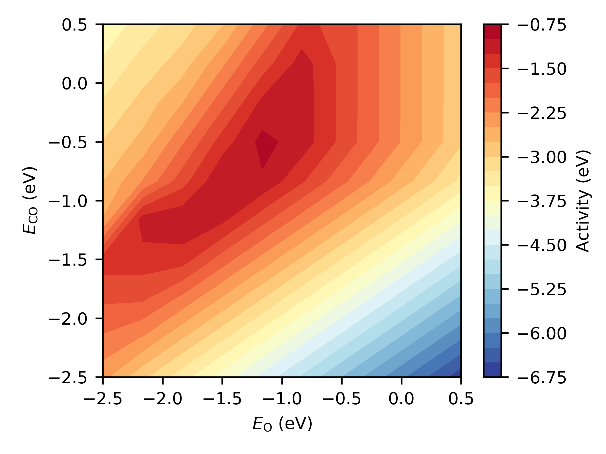

.. _cooxsurface:
.. index:: CO oxidation volcano plot

CO oxidation volcano plot
*************************************

Here we will consider the CO oxidation reaction, using scaling relations defined by Falsig and coauthors [1]_. The reaction mechanism consists of four elementary steps, involving barrierless adsorption of CO and O\ :sub:`2` gases, irreversible dissociation of O\ :sub:`2` and irreversible reaction of adsorbed CO and O to produce CO\ :sub:`2` gas. That is, where s represents a free catalyst site:

.. math::
   :nowrap:
   
    \begin{align}
        \textsf{CO} + 
        \textsf{s}
        &\leftrightarrow
        \textsf{sCO}
        \\
        {\textsf{O}}_{2} + 
        \textsf{s}
        &\leftrightarrow
        {\textsf{sO}}_{2}
        \\
        {\textsf{sO}}_{2} + 
        \textsf{s}
        &\rightarrow
        2\textsf{sO}
        \\
        \textsf{sO} + 
        \textsf{sCO}
        &\rightarrow
        {\textsf{CO}}_{2} + 
        2\textsf{s}
        \textsf{.}
    \end{align}

The scaling relations are used to specify the binding energy of O\ :sub:`2` as a function of the binding energy of O, and the transition state energies for O\ :sub:`2` dissociation and CO oxidation as a function of the binding energies of O, and CO and O respectively. This means that the system is fully specified given the reaction energies for the following two processes:

.. math::
   :nowrap:
   
    \begin{align}
        \textsf{CO} + 
        \textsf{s}
        &\leftrightarrow
        \textsf{sCO}
        & &E_{\textsf{CO}} = E_{\textsf{CO}}^{\textsf{ads}} - E_{\textsf{CO}}^{\textsf{gas}} - E_{\textsf{s}}
        \\
        \frac{1}{2}{\textsf{O}}_{2} + 
        \textsf{s}
        &\leftrightarrow
        \textsf{sO}
        & &E_{\textsf{O}} = E_{\textsf{O}}^{\textsf{ads}} - \frac{1}{2}E_{\textsf{O}}^{\textsf{gas}} - E_{\textsf{s}}
        \textsf{.}
    \end{align}

The scaling relations take the form:

.. math::
   :nowrap:
   
    \begin{align}
        E_{\textsf{ss}} = mx + c
        \textsf{,}
    \end{align}

where :math:`m` is the gradient, :math:`c` is the intercept, ss is the scaling state and :math:`x` is the descriptor (:math:`E_{\textsf{O}}` or :math:`E_{\textsf{CO}}+E_{\textsf{O}}`). Here, we will define three `scaling states` for the O\ :sub:`2` adsorbate and the two transition states. 

Creating an input file
-------------------------------------

To start with, add the other states::

    {
        "states":
        {
            "s":
            {
                "state_type": "surface"
            },
            "sCO":
            {
                "state_type": "adsorbate"
            },
            "sO":
            {
                "state_type": "adsorbate"
            },
            "CO":
            {
                "state_type": "gas",
                "sigma": 1,
                "mass": 28
            },
            "O2":
            {
                "state_type": "gas",
                "sigma": 2,
                "mass": 32
            },
            "CO2":
            {
                "state_type": "gas",
                "sigma": 2,
                "mass": 44
            }
        },...
    }

Now, add the scaling relation defined states::

    {
        "scaling relation states":
        {
            "SRTS_ox":
            {
                "state_type": "TS",
                "scaling_coeffs":
                {
                    "gradient": 0.7,
                    "intercept": 0.02
                },
                "scaling_reactions":
                {
                    "CO":
                    {
                        "reaction": "CO_ads",
                        "multiplicity": 1.0
                    },
                    "O":
                    {
                        "reaction": "2O_ads",
                        "multiplicity": 0.5
                    }
                }
            },
            "SRTS_O2":
            {
                "state_type": "TS",
                "scaling_coeffs":
                {
                    "gradient": 1.39,
                    "intercept": 1.56
                },
                "scaling_reactions":
                {
                    "O":
                    {
                        "reaction": "2O_ads",
                        "multiplicity": 0.5
                    }
                }
            },
            "sO2":
            {
                "state_type": "adsorbate",
                "scaling_coeffs":
                {
                    "gradient": 0.89,
                    "intercept": 0.17
                },
                "scaling_reactions":
                {
                    "O":
                    {
                        "reaction": "2O_ads",
                        "multiplicity": 0.5
                    }
                }
            }
        },...
    }

The scaling relation states are of the derived ``ScalingState`` ``State`` class. Scaling relation states are defined by providing a dictionary of ``scaling_coeffs``, the gradient and intercept of the scaling relation and a dictionary of ``scaling_reactions``, the reactions that specify the binding energies the scaling relation depends on. Note that the Falsig scaling relation depends on the binding energy of O, but we will define the adsorption reaction for O\ :sub:`2`, which will lead to two bound oxygen atoms; thus, we need to specify a ``multiplicity`` of 0.5. 

Next, we need to define the reactions. Here, we will use reactions of the derived class ``UserDefinedReaction``. This allows us to define the reaction energies, rather than the code computing them directly from the energies of their constituent states. We will not define the reaction energies in the input file as we want to change them later::

    {
        "manual reactions":
        {
            "O2_ads":
            {
                "reac_type": "adsorption",
                "area": 3.14e-20,
                "reactants": ["O2", "s"],
                "TS": null,
                "products": ["sO2"]
            },
            "CO_ox":
            {
                "reac_type": "Arrhenius",
                "area": 3.14e-20,
                "reactants": ["sCO", "sO"],
                "TS": ["SRTS_ox"],
                "products": ["s", "s", "CO2"],
                "reversible": false           
            },
            "O2_2O":
            {
                "reac_type": "Arrhenius",
                "area": 3.14e-20,
                "reactants": ["sO2", "s"],
                "TS": ["SRTS_O2"],
                "products": ["sO", "sO"],
                "reversible": false
            },
            "CO_ads":
            {
                "reac_type": "adsorption",
                "area": 3.14e-20,
                "reactants": ["CO", "s"],
                "TS": null,
                "products": ["sCO"]
            },
            "2O_ads":
            {
                "reac_type": "ghost",
                "area": 3.14e-20,
                "reactants": ["O2", "s", "s"],
                "TS": null,
                "products": ["sO", "sO"],
                "scaling": 0.0
            }
        },...
    }

Note that the reaction ``2O_ads`` is only defined so that we can use it in the scaling relations. As we do not want to model its kinetics, we have set the scaling of this reaction to 0.0.

Finally, specify an ``InfiniteDilutionReaction`` to ignore the mass transport and focus on the surface kinetics. And provide the details for the system::

    {
        "reactor": "InfiniteDilutionReactor",
        
        "system":
        {
            "times": [0.0, 3600.0],
            "T": 600.0,
            "p": 1.0e5,
            "start_state":
            {
                "s": 1.0,
                "CO": 0.67,
                "O2": 0.33
            },
            "verbose": false,
            "use_jacobian": true,
            "ode_solver": "ode",
            "nsteps": 1.0e5
        }
    }

Configuring the reaction energies
-------------------------------------

All that remains is to load the input file and configure the reaction energies and barriers. We will define a range of binding energies (*be*) and then loop over all combinations for CO and O and compute the *activity* that arises in a system having these descriptor values. As in the Falsig study, we will assume that adsorbates have zero entropy and take the entropies for the gas species (*SCOg*, *SO2g*) from standard tables::

    from pycatkin.functions.load_input import read_from_input_file
    import numpy as np
    
    # Load input file
    sim_system = read_from_input_file()
    
    # Define a range of binding energies
    be = np.linspace(start=-2.5, stop=0.5, num=10, endpoint=True)
    
    # Standard entropies (taken from Atkins, in eV/K)
    SCOg = 2.0487e-3
    SO2g = 2.1261e-3
    
    activity = np.zeros((len(be), len(be)))

The comments (a)-(f) in the code fragment below explain which reaction energies are being specified at each stage. First, we specify the potential energy and free energy of the CO adsorption (a) and atomic oxygen adsorption (b) steps. These steps will be used by the code to determine the potential energies of the scaling relation states *sO2*, *SRTS_O2* and *SRTS_ox* but we need to add an energy modifier to account for the entropy of adsorption of the gas molecules to obtain consistent reaction energies. This is achieved in part (c) using the state method ``set_energy_modifier``. Finally, we can use the scaling relation states to define the remaining reaction energy for diatomic oxygen adsorption (d) and the reaction barriers for CO oxidation (e) and oxygen dissociation (f). And then, compute the activity using the system method ``activity`` and specifying which reaction rate we are interested in (the CO oxidation rate, *CO_ox*)::

    for iCO, bCO in enumerate(be):
        for iO, bO in enumerate(be):

            # (a) Set CO adsorption energy and entropy
            sim_system.reactions['CO_ads'].dErxn_user = bCO
            sim_system.reactions['CO_ads'].dGrxn_user = bCO + SCOg * sim_system.params['temperature']

            # (b) Set O adsorption energy and entropy
            sim_system.reactions['2O_ads'].dErxn_user = 2.0 * bO
            sim_system.reactions['2O_ads'].dGrxn_user = 2.0 * bO + SO2g * sim_system.params['temperature']

            # (c) Add adsorption entropy change for gases
            sim_system.states['sO2'].set_energy_modifier(modifier=SO2g * sim_system.params['temperature'])
            sim_system.states['SRTS_O2'].set_energy_modifier(modifier=SO2g * sim_system.params['temperature'])
            sim_system.states['SRTS_ox'].set_energy_modifier(modifier=(0.5 * SO2g * sim_system.params['temperature'] +
                                                                       SCOg * sim_system.params['temperature']))

            # (d) Set O2 adsorption free energy
            sim_system.reactions['O2_ads'].dGrxn_user = sim_system.states['sO2'].get_free_energy(
                T=sim_system.params['temperature'],
                p=sim_system.params['pressure'])

            # (e) Set CO oxidation free energy barrier
            sim_system.reactions['CO_ox'].dGa_fwd_user = sim_system.states['SRTS_ox'].get_free_energy(
                T=sim_system.params['temperature'],
                p=sim_system.params['pressure']) - (sim_system.reactions['CO_ads'].dGrxn_user +
                                                    0.5 * sim_system.reactions['2O_ads'].dGrxn_user)

            # (f) Set O2 dissociation free energy barrier
            sim_system.reactions['O2_2O'].dGa_fwd_user = sim_system.states['SRTS_O2'].get_free_energy(
                T=sim_system.params['temperature'],
                p=sim_system.params['pressure']) - sim_system.reactions['O2_ads'].dGrxn_user

            # Now compute and save the activity
            activity[iCO, iO] = sim_system.activity(tof_terms=['CO_ox']) 

This done, the activity can be plotted as a function of the binding energies to inspect the volcano for CO oxidation::

    import matplotlib.pyplot as plt
    
    fig, ax = plt.subplots(figsize=(4, 3))
    CS = ax.contourf(be, be, activity, levels=25, cmap=plt.get_cmap("RdYlBu_r"))
    fig.colorbar(CS).ax.set_ylabel('Activity (eV)')
    ax.set(xlabel=r'$E_{\mathsf{O}}$ (eV)', ylabel=r'$E_{\mathsf{CO}}$ (eV)')
    fig.tight_layout()
    fig.savefig('activity.png', format='png', dpi=600)

   Volcano plot showing dependence of activity on binding energies of CO and O.

.. [1] Falsig, *et al.* *Angew. Chem. Int. Edit.* 47, 4835, 2008. doi: `10.1002/anie.200801479 <https://doi.org/10.1002/anie.200801479>`_..