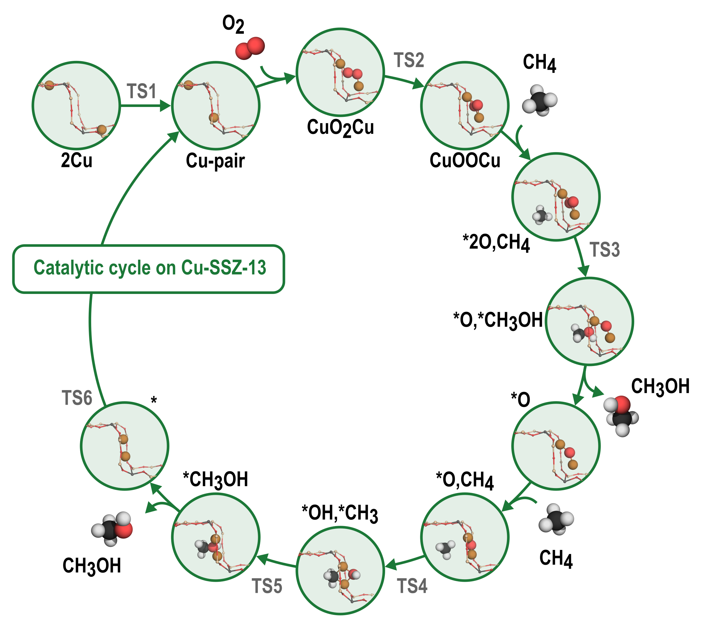
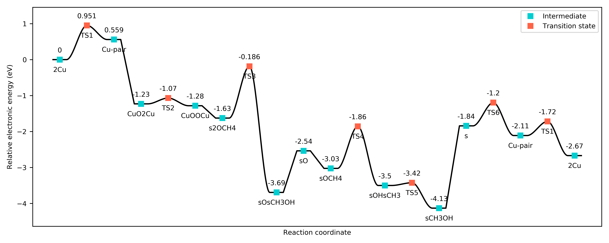
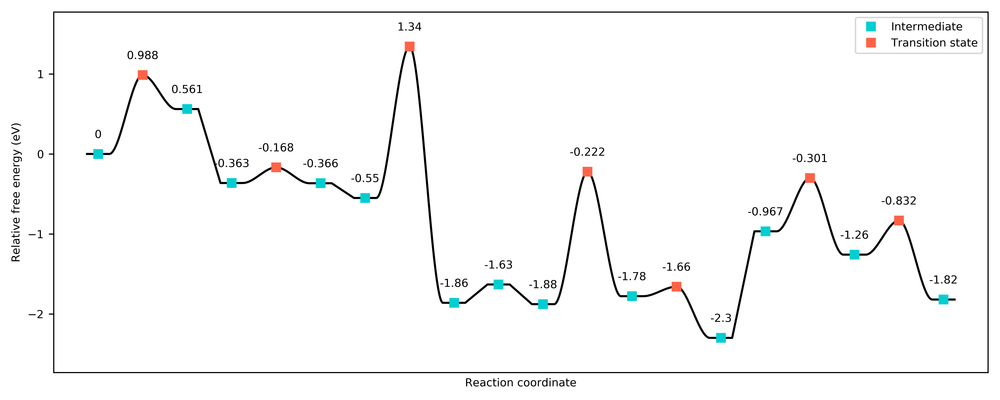
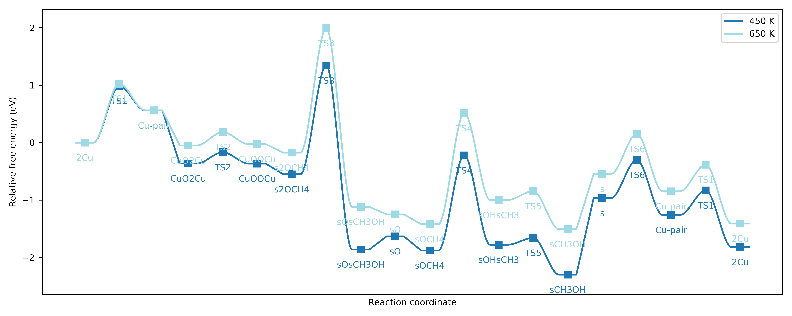
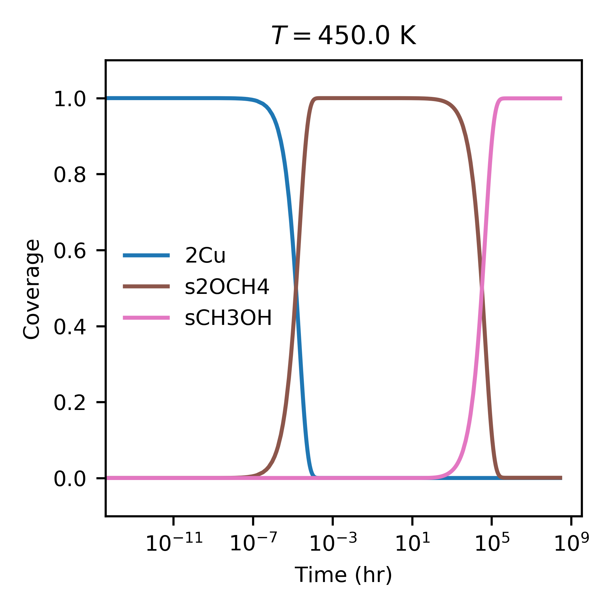
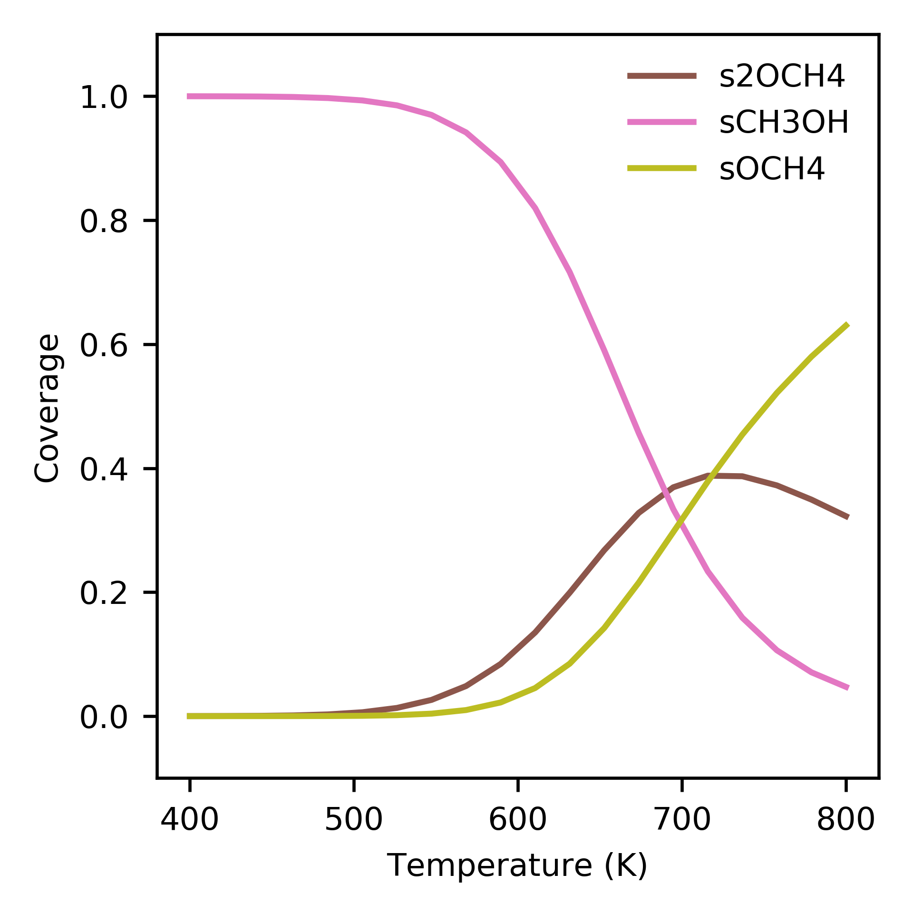
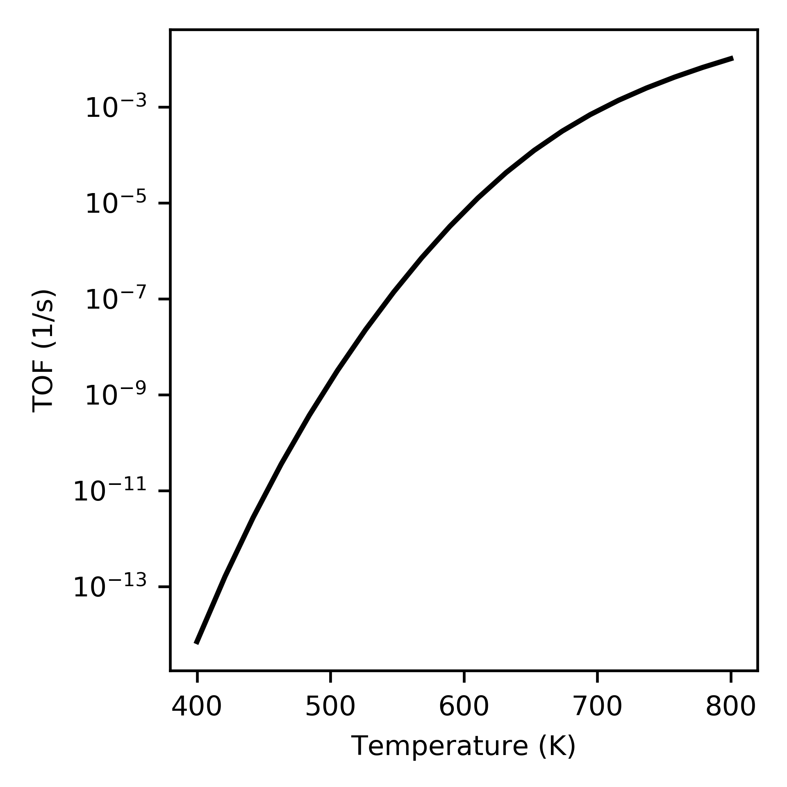
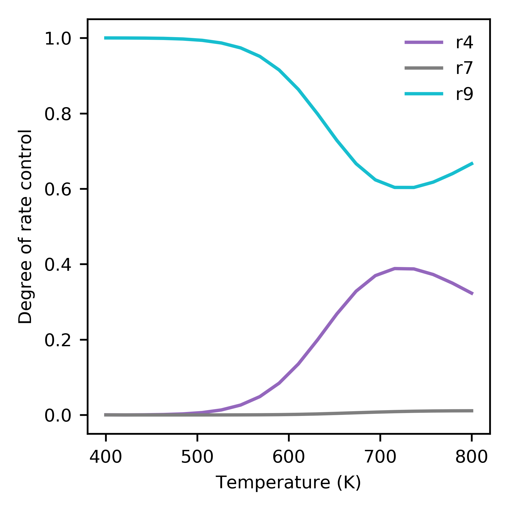

.. _dmtm:
.. index:: Direct methane to methanol

Direct methane to methanol
*************************************

Here we will consider the direct conversion of methane to methanol (DMTM) on the zeolite catalyst Cu-SSZ-13, using DFT data from Engedahl *et al.* [1]_

   Catalytic cycle showing steps in the direct conversion of methane to methanol over Cu-SSZ-13.

Creating an input file
-------------------------------------

First, we need to create an input file. The input file stores information to specify the states, the reactions, the reactor, the energy landscape, and the system (operating conditions, run time etc.). Input files are written using `JSON <https://www.json.org/json-en.html>`_ format, and resemble python dictionaries. 

All of the text should be contained in an outer brace {}, and then we can add "keys" for the different elements named above. Thus, an empty input file might look like this::

    {
        "states":
        {
            
        },
        "reactions":
        {
            
        },
        "reactor":
        {
            
        },
        "system":
        {
            
        },
        "energy landscapes":
        {
            
        }
    }

Let's start with the states. States have different types, indicated by the keyword ``state_type``. Permissable types include ``adsorbate``, ``TS`` (transition state), ``surface``, and ``gas``. In this example, we will use the harmonic approximation (only vibrational free energy contributions) for all adsorbates except methane, and the ideal gas approximation (vibrational, rotational and translational free energy contributions) for gas molecules. Methane will be treated as a hindered gas, retaining two-thirds of its translational and rotational entropy. To compute the vibrational free energy contribution, we need the vibrational frequencies computed using DFT. For the translational contribution, we need the mass of the gas molecule, and for the rotational contribution, we need to know its moment of inertia and symmetry number (``sigma``). The mass and moment of inertia can be taken from the atoms object using ASE, but the symmetry must be specified in the input file. 

In this example, the data is stored in a directory called *data*, with subdirectories for *energies* and *vibrations*. Here, the DFT data has been saved to a ``datafile`` using PyCatKin; however, it is also possible to read the data directly from an ``OUTCAR`` from VASP, or to specify a custom function to load the data. 

With this information, we can specify the states::

    {
    "states":
    {
        "2Cu":
        {
            "state_type": "adsorbate",
            "energy_source": "datafile",
            "freq_source": "datafile",
            "path": "data/energies/2Cu_energy.dat",
            "vibs_path": "data/vibrations/2Cu_frequencies.dat"
        },
        "Cu-pair":
        {
            "state_type": "adsorbate",
            "energy_source": "datafile",
            "freq_source": "datafile",
            "path": "data/energies/Cu-pair_energy.dat",
            "vibs_path": "data/vibrations/Cu-pair_frequencies.dat"
        },
        "CuO2Cu":
        {
            "state_type": "adsorbate",
            "energy_source": "datafile",
            "freq_source": "datafile",
            "path": "data/energies/CuO2Cu_energy.dat",
            "vibs_path": "data/vibrations/CuO2Cu_frequencies.dat"
        },
        "CuOOCu":
        {
            "state_type": "adsorbate",
            "energy_source": "datafile",
            "freq_source": "datafile",
            "path": "data/energies/CuOOCu_energy.dat",
            "vibs_path": "data/vibrations/CuOOCu_frequencies.dat"
        },
        "s2OCH4":
        {
            "state_type": "adsorbate",
            "energy_source": "datafile",
            "freq_source": "datafile",
            "path": "data/energies/s2OCH4_energy.dat",
            "vibs_path": "data/vibrations/s2OCH4_frequencies.dat",
            "gasdata":
            {
                "fraction": [0.67],
                "state": ["CH4"]
            }
        },
        "sOsCH3OH":
        {
            "state_type": "adsorbate",
            "energy_source": "datafile",
            "freq_source": "datafile",
            "path": "data/energies/sOsCH3OH_energy.dat",
            "vibs_path": "data/vibrations/sOsCH3OH_frequencies.dat"
        },
        "sO":
        {
            "state_type": "adsorbate",
            "energy_source": "datafile",
            "freq_source": "datafile",
            "path": "data/energies/sO_energy.dat",
            "vibs_path": "data/vibrations/sO_frequencies.dat"
        },
        "sOCH4":
        {
            "state_type": "adsorbate",
            "energy_source": "datafile",
            "freq_source": "datafile",
            "path": "data/energies/sOCH4_energy.dat",
            "vibs_path": "data/vibrations/sOCH4_frequencies.dat",
            "gasdata":
            {
                "fraction": [0.67],
                "state": ["CH4"]
            }
        },
        "sOHsCH3":
        {
            "state_type": "adsorbate",
            "energy_source": "datafile",
            "freq_source": "datafile",
            "path": "data/energies/sOHsCH3_energy.dat",
            "vibs_path": "data/vibrations/sOHsCH3_frequencies.dat"
        },
        "sCH3OH":
        {
            "state_type": "adsorbate",
            "energy_source": "datafile",
            "freq_source": "datafile",
            "path": "data/energies/sCH3OH_energy.dat",
            "vibs_path": "data/vibrations/sCH3OH_frequencies.dat"
        },
        "s":
        {
            "state_type": "adsorbate",
            "energy_source": "datafile",
            "freq_source": "datafile",
            "path": "data/energies/s_energy.dat",
            "vibs_path": "data/vibrations/s_frequencies.dat"
        },
        "TS1":
        {
            "state_type": "TS",
            "energy_source": "datafile",
            "freq_source": "datafile",
            "path": "data/energies/TS1_energy.dat",
            "vibs_path": "data/vibrations/TS1_frequencies.dat"
        },
        "TS2":
        {
            "state_type": "TS",
            "energy_source": "datafile",
            "freq_source": "datafile",
            "path": "data/energies/TS2_energy.dat",
            "vibs_path": "data/vibrations/TS2_frequencies.dat"
        },
        "TS3":
        {
            "state_type": "TS",
            "energy_source": "datafile",
            "freq_source": "datafile",
            "path": "data/energies/TS3_energy.dat",
            "vibs_path": "data/vibrations/TS3_frequencies.dat"
        },
        "TS4":
        {
            "state_type": "TS",
            "energy_source": "datafile",
            "freq_source": "datafile",
            "path": "data/energies/TS4_energy.dat",
            "vibs_path": "data/vibrations/TS4_frequencies.dat"
        },
        "TS5":
        {
            "state_type": "TS",
            "energy_source": "datafile",
            "freq_source": "datafile",
            "path": "data/energies/TS5_energy.dat",
            "vibs_path": "data/vibrations/TS5_frequencies.dat"
        },
        "TS6":
        {
            "state_type": "TS",
            "energy_source": "datafile",
            "freq_source": "datafile",
            "path": "data/energies/TS6_energy.dat",
            "vibs_path": "data/vibrations/TS6_frequencies.dat"
        },
        "O2":
        {
            "state_type": "gas",
            "sigma": 2,
            "mass": 31.998,
            "inertia": [0, 12.16520785, 12.16520785],
            "energy_source": "datafile",
            "freq_source": "datafile",
            "path": "data/energies/O2_energy.dat",
            "vibs_path": "data/vibrations/O2_frequencies.dat"
        },
        "CH4":
        {
            "state_type": "gas",
            "sigma": 12,
            "mass": 16.043,
            "inertia": [3.24529923, 3.24529923, 3.24529923],
            "energy_source": "datafile",
            "freq_source": "datafile",
            "path": "data/energies/CH4_energy.dat",
            "vibs_path": "data/vibrations/CH4_frequencies.dat"
        },
        "CH3OH":
        {
            "state_type": "gas",
            "sigma": 1,
            "mass": 32.042,
            "inertia": [4.02482703, 20.67354772, 21.42593813],
            "energy_source": "datafile",
            "freq_source": "datafile",
            "path": "data/energies/CH3OH_energy.dat",
            "vibs_path": "data/vibrations/CH3OH_frequencies.dat"
        },...
    }

The ``gas_data`` entry for states *s2OCH4* and *sOCH4* (adsorbed methane) specifies that 2/3 of the gas entropy should be retained. 

Next, let's consider reactions. The DMTM mechanism is specified by a sequence of reactions (assumed to be Arrhenius-type), adsorptions and desorptions. For each, we need to provide the reaction type, ``reac_type``, the ``area`` of the catalyst site (here, taken to be the area of the pore), and lists of ``reactants``, ``TS`` (transition states, if not barrierless) and ``products``. For barrierless reactions, the ``TS`` should be set to ``null`` in the input file. Thus the reactions section of our input file::

    {
        "reactions":
        {
            "r0":
            {
                "reac_type": "Arrhenius",
                "area": 1.4e-19,
                "reactants": ["2Cu"],
                "TS": ["TS1"],
                "products": ["Cu-pair"]
            },
            "r1":
            {
                "reac_type": "adsorption",
                "area": 1.4e-19,
                "reactants": ["Cu-pair", "O2"],
                "TS": null,
                "products": ["CuO2Cu"]
            },
            "r2":
            {
                "reac_type": "Arrhenius",
                "area": 1.4e-19,
                "reactants": ["CuO2Cu"],
                "TS": ["TS2"],
                "products": ["CuOOCu"]
            },
            "r3":
            {
                "reac_type": "adsorption",
                "area": 1.4e-19,
                "reactants": ["CuOOCu", "CH4"],
                "TS": null,
                "products": ["s2OCH4"]
            },
            "r4":
            {
                "reac_type": "Arrhenius",
                "area": 1.4e-19,
                "reactants": ["s2OCH4"],
                "TS": ["TS3"],
                "products": ["sOsCH3OH"]
            },
            "r5":
            {
                "reac_type": "desorption",
                "area": 1.4e-19,
                "reactants": ["sOsCH3OH"],
                "TS": null,
                "products": ["sO", "CH3OH"]
            },
            "r6":
            {
                "reac_type": "adsorption",
                "area": 1.4e-19,
                "reactants": ["sO", "CH4"],
                "TS": null,
                "products": ["sOCH4"]
            },
            "r7":
            {
                "reac_type": "Arrhenius",
                "area": 1.4e-19,
                "reactants": ["sOCH4"],
                "TS": ["TS4"],
                "products": ["sOHsCH3"]
            },
            "r8":
            {
                "reac_type": "Arrhenius",
                "area": 1.4e-19,
                "reactants": ["sOHsCH3"],
                "TS": ["TS5"],
                "products": ["sCH3OH"]
            },
            "r9":
            {
                "reac_type": "desorption",
                "area": 1.4e-19,
                "reactants": ["sCH3OH"],
                "TS": null,
                "products": ["s", "CH3OH"]
            },
            "r10":
            {
                "reac_type": "Arrhenius",
                "area": 1.4e-19,
                "reactants": ["s"],
                "TS": ["TS6"],
                "products": ["Cu-pair"]
            }
        },...
    }

Here, we will use a ``reactor`` of the type ``InfiniteDilutionReactor``, wherein the boundary conditions (gas concentrations) are fixed and we study only surface kinetics::

    "reactor": "InfiniteDilutionReactor",...

Now, we can specify the system. The options provided to ``system`` will determine the solver times range, temperature (T) and pressure (p), in SI units of seconds, Kelvin and Pascals respectively. The initial conditions must be provided in ``start_state``, but only nonzero starting concentrations are required. There **must** be at least one nonzero surface state, otherwise the surface has no sites for reactions to occur. In this example, the initial surface state is *2Cu* and the initial mole fractions of oxygen, methane and methanol are stipulated. Finally, the ``system`` section is used to specify solver parameters including verbosity (``verbose``, boolean), absolute and relative tolerance (``atol``, ``rtol``) of the integrator, function and stepsize tolerance (``ftol``, ``xtol``) of the steady-state solver (here, we will use the defaults), and whether to use the analytic Jacobian (``use_jacobian``, boolean). Thus, the ``system`` section may look something like this::

    {
        "system":
        {
            "times": [0.0, 1.0e12],
            "T": 400.0,
            "p": 100000.0,
            "start_state":
            {
                "O2": 0.1,
                "CH4": 0.02,
                "CH3OH": 1.0e-11,
                "2Cu": 1.0
            },
            "verbose": true,
            "use_jacobian": true,
            "atol": 1.0e-8,
            "rtol": 1.0e-6
        },...    
    }

Finally, to consider the reaction energy landscape, we can specify one (or more) pathways using the section ``energy landscapes`` as follows::

    {
        "energy landscapes":
        {
            "full_pes":
            {
                "minima":
                [
                    ["2Cu", "O2", "CH4", "CH4"],
                    ["TS1", "O2", "CH4", "CH4"],
                    ["Cu-pair", "O2", "CH4", "CH4"],
                    ["CuO2Cu", "CH4", "CH4"],
                    ["TS2", "CH4", "CH4"],
                    ["CuOOCu", "CH4", "CH4"],
                    ["s2OCH4", "CH4"],
                    ["TS3", "CH4"],
                    ["sOsCH3OH", "CH4"],
                    ["sO", "CH4", "CH3OH"],
                    ["sOCH4", "CH3OH"],
                    ["TS4", "CH3OH"],
                    ["sOHsCH3", "CH3OH"],
                    ["TS5", "CH3OH"],
                    ["sCH3OH", "CH3OH"],
                    ["s", "CH3OH", "CH3OH"],
                    ["TS6", "CH3OH", "CH3OH"],
                    ["Cu-pair", "CH3OH", "CH3OH"],
                    ["TS1", "CH3OH", "CH3OH"],
                    ["2Cu", "CH3OH", "CH3OH"]
                ],
                "labels": null
            }
        }
    }

Here, we have specified a list of states present at each minimum along the landscape in ``minima`` and that no special labels are required in ``labels``. In this case, the input file parser will assign the labels using the first string in each list ("2Cu", "TS1", etc.). 

Loading the input file 
----------------------------------

Now we can load the input file and start to run some simulations. To load the input file, create a python script (*dmtm.py*) and import the input file reader ``read_from_input_file``::

    from pycatkin.functions.load_input import read_from_input_file
    
    sim_system = read_from_input_file()

Running this script will list the states, reactions, and conditions as they are loaded. Now ``sim_system`` is ready to use. There are several preset functions that can be called to generate some common results, which can be saved as either figures or data files (.csv).

Drawing energy landscapes
----------------------------------

Let's start by examining the potential energy landscape using ``draw_energy_landscapes``::

    from pycatkin.functions.load_input import read_from_input_file
    from pycatkin.functions.presets import draw_energy_landscapes
    
    sim_system = read_from_input_file()
    
    draw_energy_landscapes(sim_system=sim_system,
                           etype='electronic',
                           show_labels=True,
                           fig_path='figures/')

   Potential energy landscape for the DMTM reaction.

or the free energy landscape at, say, 450 K::

    sim_system.params['temperature'] = 450
    draw_energy_landscapes(sim_system=sim_system,
                           fig_path='figures/')

   Free energy landscape for the DMTM reaction at 450 K.

There is another preset function we can use to compare energy landscapes (for example, for different metal sites, or at different temperatures). Here, we consider the same system at 450 K and 650 K::

    from pycatkin.functions.load_input import read_from_input_file
    from pycatkin.functions.presets import compare_energy_landscapes
    import copy
    
    sim_system = read_from_input_file()
    
    sim_system.params['temperature'] = 450
    
    sim_system2 = copy.deepcopy(sim_system)
    sim_system2.params['temperature'] = 650
    
    sim_systems = {'450 K': sim_system,
                   '650 K': sim_system2}
    
    compare_energy_landscapes(sim_systems=sim_systems,
                              legend_location='lower center',
                              show_labels=True,
                              fig_path='figures/')

   Free energy landscapes for the DMTM reaction at 450 K and 650 K.

Running simulations
----------------------------------

Next, we turn to the surface kinetics. The preset function ``run`` can be used to integrate the ODEs for surface coverage and optionally plot/save the results::

    from pycatkin.functions.load_input import read_from_input_file
    from pycatkin.functions.presets import run
    
    sim_system = read_from_input_file()
    
    run(sim_system=sim_system,
        plot_results=True,
        save_results=True,
        fig_path='figures/',
        csv_path='outputs/')

   Evolution of surface coverage at 450 K. Only showing species with more than 1 percent coverage. 

Alternately, the function ``run_temperatures`` can be used to integrate the ODEs for a range of temperatures::

    from pycatkin.functions.load_input import read_from_input_file
    from pycatkin.functions.presets import run_temperatures
    import numpy as np
    
    sim_system = read_from_input_file()
    
    temperatures = np.linspace(start=400, stop=800, num=17, endpoint=True)
    
    run_temperatures(sim_system=sim_system,
                     temperatures=temperatures,
                     steady_state_solve=True,
                     plot_results=True,
                     save_results=True,
                     fig_path='figures/',
                     csv_path='outputs/')

   Dependence of surface coverage on temperature. Only showing species with more than 1 percent coverage. 

Supplying a list of reaction names that should be considered when calculating the turnover frequency (TOF) to ``run_temperatures`` specifies that the degree of rate control (DRC) should be numerically computed at each temperature::

    tof_terms = ['r5', 'r9']
    run_temperatures(sim_system=sim_system,
                     temperatures=temperatures,
                     tof_terms=tof_terms,
                     steady_state_solve=True,
                     plot_results=True,
                     save_results=True,
                     fig_path='figures/',
                     csv_path='outputs/')

   Increase in turnover frequency (TOF) with temperature.

   Dependence of degree of rate control on temperature. Only showing species with more than 1 percent control. 

The preset functions also include the function ``run_energy_span_temperatures`` to compute the energy span model TOF and degrees of TOF control, as a function of temperature::

    from pycatkin.functions.load_input import read_from_input_file
    from pycatkin.functions.presets import run_energy_span_temperatures
    import numpy as np
    
    sim_system = read_from_input_file()
    
    temperatures = np.linspace(start=400, stop=800, num=17, endpoint=True)
    
    run_energy_span_temperatures(sim_system=sim_system,
                                 temperatures=temperatures,
                                 save_results=True,
                                 csv_path='outputs/')

Saving energies
----------------------------------

The preset functions ``save_state_energies``, ``save_energies`` and ``save_energies_temperatures`` can be used to store the free energies and free energy contributions of all states at the system temperature, and the reaction energies and barriers at a fixed/range of temperatures::

    from pycatkin.functions.load_input import read_from_input_file
    from pycatkin.functions.presets import save_state_energies, save_energies, save_energies_temperatures
    import numpy as np
    
    sim_system = read_from_input_file()
    
    temperatures = np.linspace(start=400, stop=800, num=17, endpoint=True)
    
    save_state_energies(sim_system=sim_system,
                        csv_path='outputs/')
    
    save_energies(sim_system=sim_system,
                  csv_path='outputs/')
    
    save_energies_temperatures(sim_system=sim_system,
                               temperatures=temperatures,
                               csv_path='outputs/')

.. [1] Engedahl, *et al.* *J. Phys. Chem. C* 125, 27, 14681, 2021. doi: `10.1021/acs.jpcc.1c04062 <https://doi.org/10.1021/acs.jpcc.1c04062>`_.
