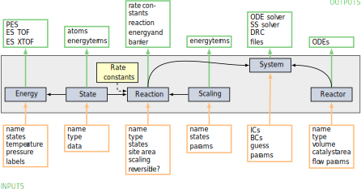

.. _overview:
.. index:: Code overview

Code overview
*********************

Here is an overview of the energetic and kinetic equations and the modular structure of the code. 

Free energies
---------------------

Energy span model
---------------------

.. math::
   :nowrap:

   \begin{equation}
      a = b
   \end{equation}

Microkinetic model
---------------------

Reactor models
---------------------

Structure of modules
---------------------
:program:`PyCatKin` is written using `object-oriented <https://docs.python.org/3/tutorial/classes.html>`_ programming.
The central modules are defined as shown in the figure below:

The modules have the following functions:
    - **State**: .
    - **Scaling**: .
    - **Energy**: .
    - **Reaction**: .
    - **Reactor**: .
    - **System**: .
    - **Uncertainty**: .

The reaction rate constants are defined in the functions file. 
